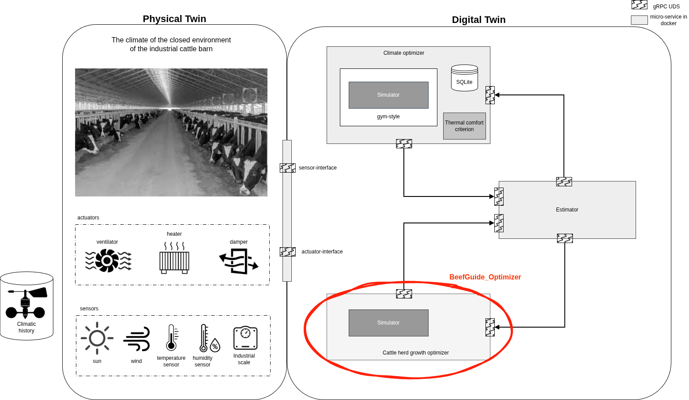

# BeefGuide_Optimizer

`BeefGuide_Optimizer` is a two-package library for turning daily climate history into a next-day climate-guidance package for a lower barn climate controller.

- `LiGAPS_Beef`: the LiGAPS-Beef herd simulator and its original input files.
- `BeefMPC_Guide`: a lightweight Economic MPC guidance layer that calls `LiGAPS_Beef` as the white-box engine and returns `x_2` on a gRPC UDS interface called `guide-interface`.

The design follows the Economic MPC interpretation analyzed from the attached MPC review: the upper layer uses a predictive model over a finite horizon, computes the best next-day target demands under constraints, and passes those target demands to a lower climate optimizer that closes the loop with heater, cooler, damper, and environmental sensors.

Digital twin status view:

## Summary

`BeefGuide_Optimizer` receives a climate request `x_1` containing a timeline of daily weather observations from the beginning of the fattening season to the present day. It runs the LiGAPS-Beef herd simulator as a white-box biological engine, extracts herd-level production indicators, evaluates recent environmental stress with lightweight Economic MPC-inspired surrogate formulas, and returns a compact guidance package `x_2` for the next 24 hours.

The returned `x_2` is not a direct actuator command. It is a target-demand package for a lower climate optimizer. That lower optimizer uses sensors and actuators in closed loop to track the requested temperature, humidity, and air-velocity bands while respecting the dominant limiting factor identified by the economic guidance layer.

## Introduction

This library is intended for a hierarchical livestock-climate optimization architecture.

At the upper layer, `BeefMPC_Guide` answers the question:

> Given the observed climate history up to now, what next-day environmental targets are most favorable for the economic objective “more beef gain with less feed”?

At the lower layer, a separate climate optimizer answers a different question:

> Given the target demands from the upper layer and the live sensor measurements, how should the heater, cooler, and damper be moved to track those targets in the real building?

This separation is useful because the white-box herd simulator and the Economic MPC reasoning operate at a daily decision level, while the low-level actuator controller operates at a much faster feedback timescale.

## What `x_1` and `x_2` mean

- `x_1`: the observed climate timeline from the beginning of the fattening season to the present time. Each row contains `WTS, YR, DOY, RAD, MINT, MAXT, VPR, WIND, RAIN, AHA, OKTA`.
- `x_2`: the daily guidance package returned by `BeefMPC_Guide`.

`x_2` is **not** a direct actuator command. It is the next-day target-demand package for the lower climate optimizer:

- target air-temperature band,
- target relative-humidity band,
- target air-velocity demand,
- dominant limiting factor,
- expected biological benefit,
- economic score,
- textual notes.

A typical `x_2` structure is:

```json
{
  "request_id": "random-window-1",
  "scenario_id": 1,
  "target_demands": {
    "air_temperature_c": [14.0, 18.0],
    "relative_humidity_pct": [55.0, 70.0],
    "air_velocity_mps": [0.4, 0.9]
  },
  "priority": "reduce_cold_stress_to_preserve_energy_for_gain",
  "expected_effect": {
    "beef_gain_kg_next_24h": 0.023,
    "feed_intake_kg_dm_next_24h": -0.042,
    "feed_efficiency_change_g_beef_per_kg_dm": 1.425
  },
  "dominant_limiting_factor": "cold_stress",
  "risk_level": "low",
  "economic_score": 12.029,
  "engine": "LiGAPS-Beef + BeefMPC-Guide; case=1",
  "notes": "LiGAPS-Beef herd feed efficiency=52.11 g beef/kg DM; beef production=506.76 kg. The target bands are daily demands x_2 for the lower heater/cooler/damper optimizer, not direct actuator commands."
}
```

## Challenges

The library is designed to address these practical challenges:

1. **Bridge herd biology and climate control**  
   LiGAPS-Beef produces biophysical herd outputs, while the lower controller needs actionable environmental targets.

2. **Use Economic MPC without heavy nonlinear online optimization**  
   A full nonlinear optimization around the complete livestock model would be too expensive for a lightweight daily service.

3. **Preserve the legacy LiGAPS-Beef simulator**  
   The original herd simulation logic and comments should remain intact.

4. **Turn partial climate history into a usable engine input**  
   The service receives only the observed timeline `x_1` up to the present day, but the legacy engine expects a long multi-year weather file.

5. **Serve guidance digitally through a clean interface**  
   The optimizer must work as a containerized UDS gRPC service that can be started and stopped independently.

6. **Keep the output useful for a lower climate controller**  
   The output must express target demands, expected biological benefit, and limiting-factor explanations, not raw simulation logs.

## Approach to solving these challenges

### 1. White-box engine + lightweight guidance layer

`LiGAPS_Beef` is used as the biological engine. `BeefMPC_Guide` does not replace the herd model. Instead, it:

- converts the request rows into a LiGAPS-compatible DataFrame,
- repeats the observed weather segment to build a long enough legacy-engine weather file,
- runs the original herd simulator in an isolated temporary working directory,
- reads a compact JSON summary from the engine,
- computes a lightweight Economic MPC-style score and target-demand package.

### 2. Hierarchical optimization

The architecture is intentionally split:

- **Upper layer**: `BeefMPC_Guide` computes the economically preferred next-day climate demands.
- **Lower layer**: the climate optimizer uses sensors and actuators to track those demands in closed loop.

This preserves a clean separation between daily economic guidance and fast actuator-level regulation.

### 3. Compatibility extensions only

The original simulator comments were preserved. The only compatibility extensions added are:

- `LIGAPS_SETTINGS_FILENAME`: lets the adapter point LiGAPS-Beef to a runtime settings file.
- `LIGAPS_OUTPUT_JSON`: lets the adapter request a JSON summary in addition to the original printed table.
- `LIGAPS_SHOW_PROGRESS`: lets service mode disable tqdm progress bars.

These changes do not alter the main herd simulation logic.

### 4. Service-oriented deployment

The optimizer is exposed as a `proto3` gRPC service over a Unix Domain Socket so it can be used as a local digital service by other optimizers, orchestrators, or containerized components.

## Mechanical formalisms used

This section lists the formulas used by the implemented library and explains their role.

### A. Generic Economic MPC objective used as the design basis

The review motivates a finite-horizon objective of the form:

$$
J = \sum_{k=0}^{N-1} \big[(y(k)-r(k))^T Q (y(k)-r(k)) + u(k)^T R u(k)\big]
$$

with state-update and constraint structure such as:

$$
x(k+1)=Ax(k)+Bu(k), \qquad y_{\min} \le y(k) \le y_{\max}, \qquad u_{\min} \le u(k) \le u_{\max}
$$

**Application in this library:**  
This generic MPC structure is adapted into a lightweight daily economic guidance score. The optimizer does not solve a full large-scale online nonlinear program. Instead, it uses the LiGAPS-Beef engine outputs plus recent climate surrogates to build an economic guidance signal for the next day.

### B. Daily economic guidance score implemented in `BeefMPC_Guide/optimizer.py`

$$
J = \lambda_F \cdot FeedPenalty - \lambda_B \cdot BeefReward + \lambda_S \cdot Stress + \lambda_U \cdot U
$$

where:

- `FeedPenalty` is inversely related to herd feed efficiency from the LiGAPS engine,
- `BeefReward` is derived from herd beef production,
- `Stress` is the total climate-stress surrogate,
- `U` is a proxy for the expected actuator effort of the lower controller.

In the code:

$$
FeedPenalty = \frac{1000}{FE_{herd}}
$$

where `FE_herd` is herd feed efficiency in g beef / kg DM.

$$
BeefReward = \frac{BeefProduction_{herd}}{100}
$$

where `BeefProduction_herd` is herd beef production in kg.

$$
EconomicScore = \lambda_F FeedPenalty - \lambda_B BeefReward + \lambda_S TotalStress + \lambda_U ControlCost
$$

**Application in this library:**  
This score ranks the current climate situation economically. Lower feed penalty and higher beef reward improve the score, while stress and control burden worsen it. The final numeric value is returned as `economic_score` in `x_2`.

### C. Mean recent temperature used in the stress surrogates

$$
T_{mean} = \text{mean}\left(\frac{MINT + MAXT}{2}\right)
$$

where `MINT` and `MAXT` are the recent daily minimum and maximum temperatures.

**Application in this library:**  
This gives a lightweight dry-bulb temperature summary over the recent window, used to identify whether the recent climate has a stronger heat-stress or cold-stress character.

### D. Heat-stress surrogate

$$
HeatStress = \max(0, T_{mean} - 22)^2 + 2\max(0, VPR - 1.8)^2 - 0.25\,WIND
$$

where:

- `T_mean` is the recent mean temperature in °C,
- `VPR` is recent mean vapour pressure in kPa,
- `WIND` is recent mean wind speed in m s\(^{-1}\).

**Application in this library:**  
This is a lightweight proxy for thermal and vapour-load discomfort under hot conditions. The negative wind term reflects the idea that air movement helps convective heat release.

### E. Cold-stress surrogate

$$
ColdStress = \max(0, 8 - T_{mean})^2 + 0.15\,WIND + 0.02\,RAIN
$$

where:

- `T_mean` is the recent mean temperature in °C,
- `WIND` is recent mean wind speed in m s\(^{-1}\),
- `RAIN` is recent mean rainfall in mm day\(^{-1}\).

**Application in this library:**  
This is a lightweight proxy for effective cold exposure. Lower temperatures increase the stress sharply, while wind and rain add to the penalty.

### F. Humidity-load surrogate

$$
HumidityStress = \max(0, VPR - 2.0)^2
$$

where `VPR` is the recent mean vapour pressure in kPa.

**Application in this library:**  
This term represents the ventilation and dampness burden that the lower climate controller may need to correct using dampers and cooling.

### G. Total stress

$$
TotalStress = \max(0, HeatStress) + \max(0, ColdStress) + \max(0, HumidityStress)
$$

**Application in this library:**  
This aggregate stress value is used in the economic score and in the next-day effect estimate.

### H. Dominant limiting-factor selection

The implemented logic is a piecewise decision rule:

- if `HeatStress >= ColdStress` and `HeatStress >= HumidityStress`, use the **heat-stress** guidance package,
- else if `ColdStress >= HumidityStress`, use the **cold-stress** guidance package,
- else use the **humidity-load** guidance package.

**Application in this library:**  
This rule determines the returned temperature band, humidity band, air-velocity band, and textual priority string in `x_2`.

### I. Expected next-24h effect surrogate

The guidance layer uses a bounded stress-reduction factor:

$$
StressReduction = \max(0.1, \min(1.5, TotalStress/10 + 0.15))
$$

Then it computes the approximate next-day biological benefit:

$$
\Delta Beef = 0.12 \cdot StressReduction
$$

$$
\Delta Feed = -0.22 \cdot StressReduction
$$

$$
\Delta FE = 7.5 \cdot StressReduction
$$

where:

- `ΔBeef` is expected beef gain improvement in kg over the next 24 h,
- `ΔFeed` is expected feed-intake reduction in kg DM over the next 24 h,
- `ΔFE` is expected feed-efficiency improvement in g beef / kg DM.

**Application in this library:**  
These formulas generate the `expected_effect` block returned in `x_2`.

### J. Risk classification rule

The implementation uses a simple piecewise classification:

- if `TotalStress >= 9.0`, risk is `high`,
- else if `TotalStress >= 3.0`, risk is `moderate`,
- else risk is `low`.

**Application in this library:**  
This produces the `risk_level` field in `x_2`.

### K. Legacy weather tiling used by the adapter

If the request history contains `n` rows and the legacy engine needs at least `M` rows, the adapter repeats the request history

$$
reps = \left\lceil \frac{M}{n} \right\rceil
$$

and then truncates the tiled sequence to the target length.

It also resets:

$$
WTS = 1, 2, \dots, M
$$

$$
YR_i = YR_{base} + \left\lfloor \frac{i}{365} \right\rfloor
$$

$$
DOY_i = (i \bmod 365) + 1
$$

**Application in this library:**  
This preserves compatibility with the legacy LiGAPS-Beef script, which expects a long weather trajectory.

## Interface

The service is gRPC-based over a Unix Domain Socket (UDS) and uses `proto3`.

Proto file:

- `BeefMPC_Guide/proto/guide.proto`

Service name:

- `BeefGuideService`

RPC:

- `GetDailyGuide(GuideRequest) -> GuideResponse`

Default socket path:

- `/tmp/beefguide/guide-interface.sock`

## Project layout

```text
BeefGuide_Optimizer/
├── BeefMPC_Guide/
│   ├── __init__.py
│   ├── engine_adapter.py
│   ├── optimizer.py
│   ├── service.py
│   ├── test_client.py
│   ├── guide_pb2.py
│   ├── guide_pb2_grpc.py
│   └── proto/
│       └── guide.proto
├── LiGAPS_Beef/
│   ├── LiGAPSBeef_herd.py
│   ├── FRACHA19982012.csv
│   ├── AUSTRALIA1992A.csv
│   ├── ligaps_graphs.py
│   └── settings.json
├── Dockerfile
├── requirements.txt
└── README.md
```

## Results

The current implementation produces a compact JSON guidance package for the next 24 hours. A representative output is:

- target temperature band,
- target relative-humidity band,
- target air-velocity band,
- dominant limiting factor,
- expected next-24h changes in beef gain, feed intake, and feed efficiency,
- risk level,
- economic score,
- notes summarizing the LiGAPS-Beef engine result.

In a cold-stress case, the optimizer returns a warmer temperature band, lower target air velocity, and a priority string such as `reduce_cold_stress_to_preserve_energy_for_gain`. In a heat-stress case, it requests cooler and more ventilated conditions. In a humidity-load case, it biases the lower controller toward vapour removal at lower energy penalty.

So the implemented result is a practical `x_1 -> x_2` transformation:

- `x_1`: observed climate history up to now,
- `Y`: LiGAPS-Beef engine plus Economic MPC-style guidance layer,
- `x_2`: next-day target-demand package for the lower heater/cooler/damper controller.

## Installation without Docker

Create a Python environment and install dependencies:

```bash
python3 -m venv .venv
source .venv/bin/activate
pip install -r requirements.txt
```

## Run the service locally

```bash
python -m BeefMPC_Guide.service --socket-path /tmp/beefguide/guide-interface.sock
```

The service runs in the foreground. Stop it with `Ctrl+C`.

## Manual test with a random FRACHA window

In another terminal, send a random contiguous climate window from `FRACHA19982012.csv`:

```bash
python -m BeefMPC_Guide.test_client \
  --socket-path /tmp/beefguide/guide-interface.sock \
  --csv LiGAPS_Beef/FRACHA19982012.csv \
  --request-id random-window-1 \
  --scenario-id 1 \
  --window-days 45 \
  --seed 7
```

The client prints the optimized `x_2` package as JSON.

## Docker usage

Build the image:

```bash
sudo docker build -t beefguide-optimizer .
```

Start the service container and expose the UDS socket through a bind-mounted directory:

```bash
mkdir -p /tmp/beefguide

sudo docker run -d \
  --name beefguide-service \
  -v /tmp/beefguide:/tmp/beefguide \
  beefguide-optimizer
```

The service now widens the permissions on the bind-mounted UDS directory and the
`guide-interface.sock` file, so a normal host Python process can call the socket
حتى if the container itself was started with `sudo docker run ...`. This avoids the
need to run the client with `sudo`, which would otherwise conflict with a user-owned
virtual environment.

For an additional hardening option, you can also start the container with your host
UID and GID so new files are not owned by root on the mount:

```bash
sudo docker run -d \
  --name beefguide-service \
  --user "$(id -u):$(id -g)" \
  -v /tmp/beefguide:/tmp/beefguide \
  beefguide-optimizer
```

Stop the service:

```bash
sudo docker stop beefguide-service
```

Remove the container:

```bash
sudo docker rm beefguide-service
```

Run the test client from the host Python environment against the running container service:

```bash
python -m BeefMPC_Guide.test_client \
  --socket-path /tmp/beefguide/guide-interface.sock \
  --csv LiGAPS_Beef/FRACHA19982012.csv \
  --request-id random-window-1 \
  --scenario-id 1 \
  --window-days 45 \
  --seed 7
```

## Docker resource pinning: only CPU core 6 and 4 GB RAM

If the host has 8 logical CPU cores and you want the service to use **only core 6** with **4 GB** of memory, two Docker options are needed:

- CPU pinning: `--cpuset-cpus="6"`
- memory limit: `--memory="4g" --memory-swap="4g"`

### Direct `docker run` example

```bash
mkdir -p /tmp/beefguide

sudo docker run -d \
  --name beefguide-service \
  --cpuset-cpus="6" \
  --memory="4g" \
  --memory-swap="4g" \
  --user "$(id -u):$(id -g)" \
  -v /tmp/beefguide:/tmp/beefguide \
  beefguide-optimizer
```

This keeps the service on host logical CPU core 6 only and caps RAM at 4 GB without changing the optimizer logic.

### YAML service configuration

A ready-to-use Compose file is included:

- `docker-compose.cpu6-4g.yml`

Its core settings are:

```yaml
services:
  beefguide-service:
    image: beefguide-optimizer
    container_name: beefguide-service
    cpuset: "6"
    mem_limit: 4g
    memswap_limit: 4g
    volumes:
      - /tmp/beefguide:/tmp/beefguide
    command: ["python", "-m", "BeefMPC_Guide.service", "--socket-path", "/tmp/beefguide/guide-interface.sock"]
    restart: unless-stopped
```


Use it like this:

```bash
sudo docker build -t beefguide-optimizer .
mkdir -p /tmp/beefguide
sudo docker compose -f docker-compose.cpu6-4g.yml up -d
```

Stop it:

```bash
sudo docker compose -f docker-compose.cpu6-4g.yml down
```

Inspect the running limits:

```bash
sudo docker inspect beefguide-service --format '{{.HostConfig.CpusetCpus}} {{.HostConfig.Memory}}'
```

The expected memory value is `4294967296` bytes, which is 4 GB.

## References

1. The attached review article: *A review of model predictive control in precision agriculture*. [doi:10.1016/j.atech.2024.100716](https://doi.org/10.1016/j.atech.2024.100716)
2. The attached LiGAPS-Beef article set:
   - *LiGAPS-Beef, a mechanistic model to explore potential and feed-limited beef production 1: model description and illustration*. [doi:10.1017/S1751731118001726](https://doi.org/10.1017/S1751731118001726)
   - *LiGAPS-Beef, a mechanistic model to explore potential and feed-limited beef production 2: sensitivity analysis and evaluation of sub-models*. [doi:10.1017/S1751731118001738](https://doi.org/10.1017/S1751731118001738)
   - *LiGAPS-Beef, a mechanistic model to explore potential and feed-limited beef production 3: model evaluation*. [https://doi:10.1017/S1751731118002641](https://doi.org/10.1017/S1751731118002641)
